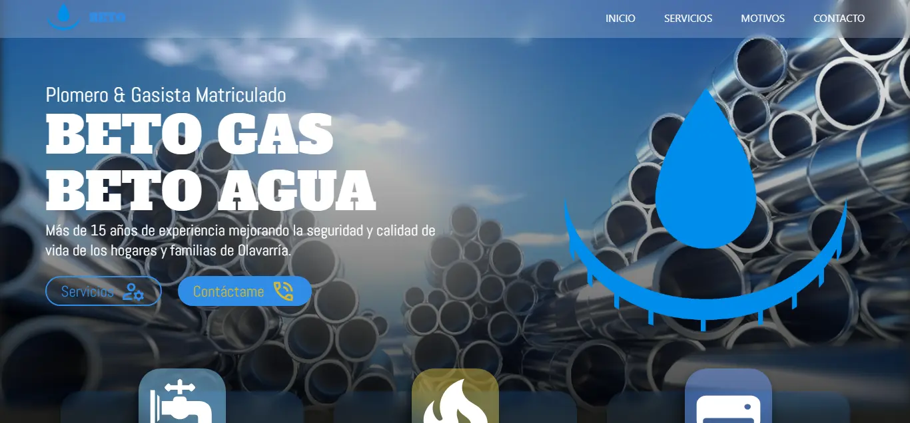
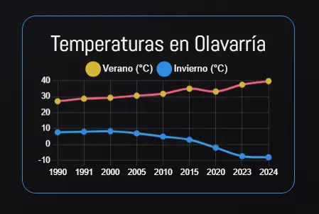
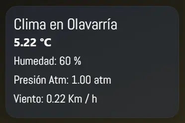

# Página Web de Servicios de Plomería y Gas

¡Bienvenidos a la página web oficial de nuestros servicios de plomería y gas! 🛠️💧

[💻 Visita el Sitio Web Aqui.](https://eitansteven.github.io/beto-service)

## Descripción

Somos un equipo profesional de plomeros y gasistas matriculados con más de 15 años de experiencia en el rubro. Nos especializamos en brindar soluciones eficientes y confiables para todas sus necesidades de plomería y gas. Nuestra misión es ofrecer un servicio de alta calidad, asegurando la satisfacción y seguridad de nuestros clientes.

## Tecnologías Utilizadas 💻

Esta página web ha sido desarrollada utilizando las siguientes tecnologías:

- **React**: Biblioteca de JavaScript para construir interfaces de usuario.
- **Chart.js**: Biblioteca para crear gráficos interactivos y visualmente atractivos.
- **OpenWeatherMap API**: Servicio API utilizado para mostrar información climática actualizada.

## Funcionalidades

- Información detallada sobre nuestros servicios.
- Gráficos interactivos para visualizar datos importantes.
- Actualizaciones climáticas en tiempo real.

¡Gracias por visitarnos y confiar en nuestros servicios!

[💻 Visita el Sitio Web Aqui.](https://eitansteven.github.io/beto-service)
